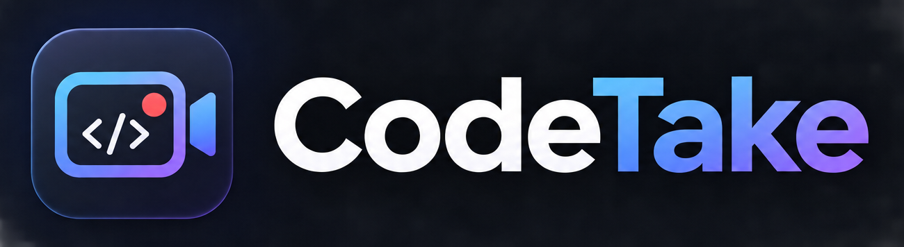

<p align="center">
  
</p>

<h1 align="center">CodeTake</h1>

<p align="center"><strong>Record your code.</strong><br>
A free, open-source, local-first screen and webcam recorder for developers.</p>

---

CodeTake does one thing: record you coding — your screen, your webcam and
your voice — into a normal MP4 on your own disk. Configure, press Record,
press Stop, done. It is not a video editor.

## Features

- **Screen capture** of a whole display or a single window, at the source's
  native resolution or downscaled to 1080p, 1440p or 4K (never upscaled),
  at 30 or 60 FPS.
- **Webcam overlay** composited into the video: drag it anywhere in the
  preview, resize it, and choose a circle, square or wide rectangle.
- **Microphone** recording with a live level meter.
- **System audio** (sound from other apps), mixed into the same track.
- **Background music** from a few bundled, public-domain (CC0) loops, with
  a volume control.
- **Live preview** of the final composition before you record.
- **Countdown** (3, 2, 1; can be turned off), **pause/resume**, and a
  recording timer.
- **Menu bar controls**: see what will be recorded, start, pause and stop
  without opening the window. Closing the window keeps CodeTake there.
- **Global shortcut**: <kbd>⌘</kbd><kbd>⇧</kbd><kbd>R</kbd>
  (<kbd>Ctrl</kbd><kbd>Shift</kbd><kbd>R</kbd>) starts and stops recording.
- **Automatic file names**, organized by day:
  `~/Movies/CodeTake/2026-09-26/coding-session-2026-09-26-09-32-14.mp4`.
  The folder can be changed.
- **MP4 / H.264 / AAC** output for maximum compatibility, hardware encoded.
- **Crash safety**: media is written progressively; if CodeTake or your Mac
  crashes, the recording up to the last two seconds is recovered on the next
  launch. Running out of disk space stops and saves the recording instead of
  losing it.
- CodeTake never records its own window.

## Supported platforms

| Platform | Status |
| --- | --- |
| **macOS 13 Ventura or later** (Apple silicon and Intel) | ✅ Supported |
| Windows | 🚧 Not implemented yet — the app opens and explains this; recording is disabled |
| Linux | 🚧 Not implemented yet — the app opens and explains this; recording is disabled |

CodeTake does not pretend to work where it doesn't. The Windows
(Windows.Graphics.Capture + Media Foundation) and Linux (XDG Desktop Portal
+ PipeWire) backends are the most valuable contributions right now — see
[docs/architecture.md](docs/architecture.md#adding-a-platform).

## Installation

Pre-built releases will be published on the
[GitHub Releases](https://github.com/sebastianfelipe/codetake/releases) page
(`.dmg` for macOS). Until then, build it from source (below): the result is
a regular `CodeTake.app`.

On first use macOS asks for three permissions. CodeTake explains each one
and links to the right pane of System Settings:

- **Screen Recording** — to capture your screen and system audio. After
  granting it, quit and reopen CodeTake (macOS requires this).
- **Camera** — only if the webcam overlay is enabled.
- **Microphone** — only if the microphone is enabled.

## Development

Requirements: macOS 13+, Xcode Command Line Tools, [Rust](https://rustup.rs)
(stable), Node.js 20+ and [pnpm](https://pnpm.io).

```sh
pnpm install
pnpm dev        # run the app with hot reload
pnpm build      # build CodeTake.app and the .dmg
```

Checks (also run in CI):

```sh
pnpm check                     # Biome format + lint
pnpm typecheck                 # TypeScript
pnpm test                      # frontend tests (Vitest)
cd apps/desktop/src-tauri
cargo fmt --check && cargo clippy --all-targets -- -D warnings && cargo test
```

See [docs/development.md](docs/development.md) for the project layout, the
browser-only UI mode, and command-line tools for testing capture.

## Architecture

A Tauri 2 app: a small React + TypeScript UI, and a Rust core that owns
recording. Capture and encoding sit behind platform-independent traits
(`ScreenCapture`, `CameraCapture`, `MicrophoneCapture`, `SystemAudioCapture`,
`VideoEncoder`); the recorder, audio mixer and webcam compositor are plain,
tested Rust. On macOS the backend uses ScreenCaptureKit, AVFoundation,
VideoToolbox (through AVAssetWriter) and AudioToolbox — no FFmpeg.

Details: [docs/architecture.md](docs/architecture.md) and
[docs/recording.md](docs/recording.md).

## Privacy

CodeTake is local-first:

- No accounts, no telemetry, no analytics, no tracking.
- No network requests and no cloud uploads.
- Recordings, settings and everything captured stay on your computer.

## Roadmap

See [docs/roadmap.md](docs/roadmap.md). Editing, automatic zoom, cursor
effects and similar features are deliberately out of scope for the first
version.

## Contributing

Contributions are welcome — please read [CONTRIBUTING.md](CONTRIBUTING.md)
and the [Code of Conduct](CODE_OF_CONDUCT.md).

## License

[MIT](LICENSE). The bundled music is CC0 (see
[assets/music](assets/music/README.md)); third-party components are listed
in [THIRD_PARTY_LICENSES.md](THIRD_PARTY_LICENSES.md).
